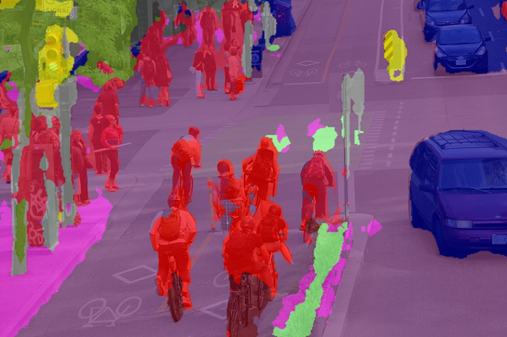

# PixelLib
Pixellib is a library for performing segmentation of images. It supports the two major types of image segmentation: 

**1.Semantic segmentation**

**2.Instance segmentation**

You can implement both semantic and instance segmentation with few lines of code.

# Install PixelLib and its dependencies:

Install latest version of tensorflow(Tensorflow 2.0+) with:

**pip3 install tensorflow**

Install Matplotlib with:

**pip3 install matplotlib**

Install Pillow with:

**pip3 install pillow**

Install Scipy with:

**pip3 install scipy**

Install Ipython with:

**pip3 install Ipython**

Install Skimage with:

**pip3 install scikit-image**

Install h5py with:

**pip3 install h5py**

## Install Pixellib with:
**pip3 install pixellib**

**Note:** The whl file of pixellib is not yet available on pypi, get it from [here](https://github.com/ayoolaolafenwa/PixelLib/releases/download/0.1.0/pixellib-0.1.0-py3-none-any.whl).

--[SEMANTIC SEGMENTATION WITH PIXELLIB](#semantic-segmentation-with-pixellib)


--[INSTANCE SEGMENTATION WITH PIXELLIB](#instance-segmentation-with-pixellib)


# SEMANTIC SEGMENTATION WITH PIXELLIB:
Pixellib is implemented with Deeplabv3+ framework to perform semantic segmentation.  Xception models pretrained on pascalvoc and cityscapes datasets are used for semantic segmentation. 

## Semantic segmentation with xception model pretrained on pascalvoc.
```python
from pixellib.semantic import semantic_segmentation

segment_image = semantic_segmentation()
segment_image.load_pascalvoc_model("deeplabv3_xception_tf_dim_ordering_tf_kernels.h5") 
segment_image.segmentAsPascalvoc("path_to_image", output_image_name = "path_to_output_image", segmap_only = True)

```
We shall take a look into each line of code....
```python
from pixellib.semantic import semantic_segmentation

#created an instance of semantic segmentation class
segment_image = semantic_segmentation()
```
The class for performing semantic segmentation is imported from pixellib and we created an instance of the class. 

```python
segment_image.load_pascalvoc_model("deeplabv3_xception_tf_dim_ordering_tf_kernels.h5") 
```
We called the function to load the xception model trained on pascal voc. The xception model can be download from [here](https://github.com/bonlime/keras-deeplab-v3-plus/releases/download/1.1/deeplabv3_xception_tf_dim_ordering_tf_kernels.h5).

```python
segment_image.segmentAsPascalvoc("path_to_image", output_image_name = "path_to_output_image", segmap_only = True)
```
This is the line of code that performs segmentation on an image and the segmentation is done in the pascalvoc's color format. This function takes in three parameters:

*path_to_image:* the path to the image to be segemented.

*path_to_output_image:* the path to save the output image. The image will be saved in your current working directory.

*segmap_only:*  It is a parameter with a boolean value that determines the type of result obtained. If it is set to true only the segmentation map of the image is shown.If it is set to false it shows both the input image, segmentation overlay on the image and the segmentation map.

# sample1.jpg


```python
from pixellib.semantic import semantic_segmentation

segment_image = semantic_segmentation()
segment_image.load_pascalvoc_model("deeplabv3_xception_tf_dim_ordering_tf_kernels.h5") 
segment_image.segmentAsPascalvoc("sample1.jpg", output_image_name = "output_image.jpg", segmap_only = True)

```


The segmentation mask of the image above. Only the segmentation map is shown because segmap_only is set to true.

```python
segment_image.segmentAsPascalvoc("path_to_image", output_image_name = "path_to_output_image", segmap_only = False)
```


When the parameter *segmap_only* is set to False the output result shows the input image, segementation overlay and the segmentation map of the image.


## Semantic segmentation with xception model pretrained on cityscapes.
```python
from pixellib.semantic import semantic_segmentation

segment_image = semantic_segmentation()
segment_image.load_cityscapes_model("deeplabv3_xception_tf_dim_ordering_tf_kernels_cityscapes.h5") 
segment_image.segmentAsCityscapes("/path_to_image", output_image_name = "output_image_path", segmap_only =True)

```
We shall take a look into each line of code....
```python
from pixellib.semantic import semantic_segmentation

#created an instance of semantic segmentation class
segment_image = semantic_segmentation()
```
The class for performing semantic segmentation is imported from pixellib and we created an instance of the class. 

```python
segment_image.load_cityscapes_model("deeplabv3_xception_tf_dim_ordering_tf_kernels_cityscapes.h5") 
```
We called the function to load the xception model trained on cityscapes. xception model can be downloaded from [here](https://github.com/bonlime/keras-deeplab-v3-plus/releases/download/1.2/deeplabv3_xception_tf_dim_ordering_tf_kernels_cityscapes.h5)

```python
segment_image.segmentAsCityscapes("path_to_image", output_image_name = "output_image_path", segmap_only =True)

```
This is the line of code that performs segmentation on an image and the segmentation is done in the cityscapes's color format. This function takes in three parameters:

*path_to_image:* the path to the image to be segmented.

*path_to_output_image:* the path to save the output image. The image will be saved in your current working directory.

*segmap_only:*  It is a parameter with a boolean value that determines the type of result obtained. If it is set to true only the segmentation map of the image is shown.If it is set to false it shows both the input image and the segmentation map.

# sample2.jpg


```python
from pixellib.semantic import semantic_segmentation

segment_image = semantic_segmentation()
segment_image.load_cityscapes_model("deeplabv3_xception_tf_dim_ordering_tf_kernels_cityscapes.h5") 
segment_image.segmentAsCityscapes("sample2.jpg", output_image_name = "image_new", segmap_only = True)

```


The segmentation map of the image above. Only the segmentation map is shown because segmap_only is set to true.

```python
segment_image.segmentAsPascalvoc("path_to_image", output_image_name = "path_to_output_image", segmap_only = False)
```


When the parameter *segmap_only* is set to False the output result shows the input image and the segmentation map of the image.

# INSTANCE SEGMENTATION WITH PIXELLIB:
The results obtained with semantic segmentation look great, but it may not be enough for some specific uses of image segmentation. In semantic segmentation objects of the same category are given the same colormap. For example if there are five people in an image, they will all be given the same colormap. Semantic segmentation might not provide adequate information about an image. The need for an effective image segmentation gives rise to the invention of *instance segmentation*. In instance segmentation objects of the same category are given different colormaps. 

Instance segmentation with Pixellib is based on MaskRCNN framework.

# Code to implement instance segmentation:

```python
from pixellib.instance import instance_segmentation

segment_image = instance_segmentation()
segment_image.load_model("mask_rcnn_coco.h5") 
segment_image.segmentImage("path_to_iamge", output_image_name = "output_image_path", show_boxes = True)

```
## Take a look at each line of code
```python
from pixellib.instance import instance_segmentation

segment_image = instance_segmentation()
```
The class for performing instance segmentation is imported and we created an instance of the class.

```python
segment_image.load_model("mask_rcnn_coco.h5") 
```
This is the code to load the mask rcnn model to perform instance segmentation. Download the mask rcnn model from [here](https://github.com/matterport/Mask_RCNN/releases/download/v2.0/mask_rcnn_coco.h5)

```python
segment_image.segmentImage("path_to_image", output_image_name = "output_image_path", show_boxes = True)
```
This is the code to perform instance segmentation on an image and it takes three parameters:

*path_to_image:* The path to the image to be predicted by the model.

*output_image_name:* The path to save the segmentation result. It will be saved in your current working directory.

*show_boxes:* This is a parameter with a boolean value it determines the type of segmentation result. If it is set to true it shows bounding boxes with their corresponding probabilities around each of the segmented objects in the image.

```python
from pixellib.instance import instance_segmentation

segment_image = instance_segmentation()
segment_image.load_model("mask_rcnn_coco.h5") 
segment_image.segmentImage("sample2.jpg", output_image_name = "image_new.jpg", show_boxes = True)

```


```python
segment_image.segmentImage("sample2.jpg", output_image_name = "image_new.jpg", show_boxes = False)
```
**show_boxes** is set to false, objects in the image are segmented with no bounding boxes.


# sample3.jpg


```python
segment_image.segmentImage("sample3.jpg", output_image_name = "image_new.jpg", show_boxes = True)
```


```python
segment_image.segmentImage("sample3.jpg", output_image_name = "image_new.jpg", show_boxes = False)
```


## References
1. Bonlime, Keras implementation of Deeplab v3+ with pretrained weights  https://github.com/bonlime/keras-deeplab-v3-plus

2. Liang-Chieh Chen. et al, Encoder-Decoder with Atrous Separable Convolution for Semantic Image Segmentationhttps://arxiv.org/abs/1802.02611

3. Matterport, Mask R-CNN for object detection and instance segmentation on Keras and TensorFlow https://github.com/matterport/Mask_RCNN

4. Kaiming He et al, Mask R-CNN https://arxiv.org/abs/1703.06870

[Back To Top](#pixellib)
